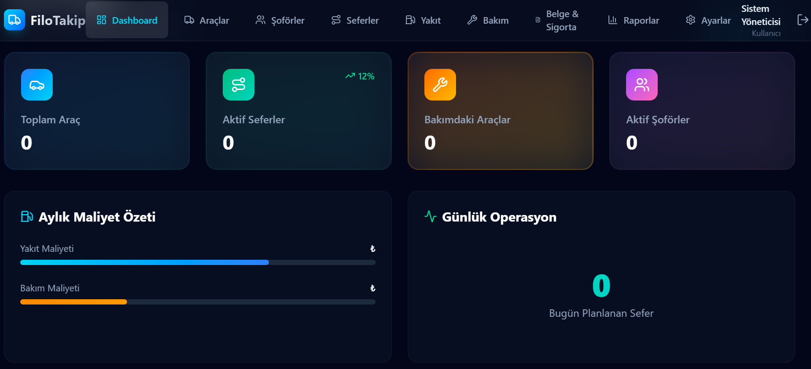

# 🚚 Filo Takip Sistemi

<p align="center">
  
  
  
  
  
  
  
</p>

Araç filolarını tek merkezden yönetmek için geliştirilmiş modern, ölçeklenebilir tam yığın web uygulaması. Araç, şoför, sefer, yakıt tüketimi, bakım geçmişi ve belge/sigorta süreçlerini uçtan uca takip eder; maliyet ve performans analizleri sunar.

---

##  Ekran Görüntüleri

<div align="center">
  <h3> Dashboard / Genel Bakış</h3>
  
  <!-- <p><i>Filo metrikleri, aktif seferler, yaklaşan bakımlar ve belge uyarıları</i></p> -->
</div>

<br/>

<div align="center">
  <table border="0">
    <tr>
      <td width="50%" align="center">
        <b></b><br/>
        
      
    </tr>
  </table>
</div>

---

##  Özellikler

- **Araç Yönetimi:** Araç kaydı, teknik detaylar, fotoğraf galerisi, kilometre geçmişi, muayene/sigorta geçerlilik alarmları.
- **Şoför Yönetimi:** Şoför profilleri, ehliyet sınıfı & süresi takibi, araç eşleştirme.
- **Sefer Yönetimi:** Sefer oluşturma, onay süreçleri, tahmini ve fiili km takibi.
- **Yakıt Takibi:** Yakıt fiş/fatura girişleri, 100 km başı ortalama tüketim analizi, anormal tüketim uyarıları.
- **Bakım & Servis:** Periyodik bakım takvimi, parça/işçilik masrafları, yaklaşan bakım bildirimleri.
- **Belge & Sigorta:** Kasko, trafik sigortası ve araç evrakları takibi, PDF/görsel yükleme.
- **Raporlama & Analiz:** Araç bazlı toplam sahip olma maliyeti (TCO), şoför performans puanlaması ve filo özet raporları.
- **Yetkilendirme:** JWT tabanlı rol yönetimi (`Admin`, `Yonetici`, `Kullanici`).

---

##  Teknolojiler

| Katman | Teknoloji / Kütüphane |
|---|---|
| **Frontend** | React 19, TypeScript, Vite, Tailwind CSS, Lucide React, Axios |
| **Backend** | ASP.NET Core Web API (.NET 10), EF Core, Dapper |
| **Veritabanı** | Microsoft SQL Server 2022 |
| **Güvenlik** | JWT (JSON Web Tokens), BCrypt Password Hashing |
| **DevOps & Dağıtım** | Docker, Docker Compose, Nginx (Alpine) |

---

##  Hızlı Başlangıç (Docker ile)

Önkoşul: [Docker Desktop](https://www.docker.com/products/docker-desktop/)

```bash
# 1. Ortam değişkenleri şablonunu kopyalayın
cp .env.example .env        # Windows (PowerShell): Copy-Item .env.example .env

# 2. .env dosyasını açıp gerekli alanları tanımlayın (veya varsayılan bırakın)

# 3. Konteynerleri derleyip ayağa kaldırın
docker compose up -d --build
```

### Erişim Adresleri

| Servis | Adres | Varsayılan Giriş |
|---|---|---|
| **Web Arayüzü (Frontend)** | [http://localhost:5173](http://localhost:5173) | `admin@filo.com` / `.env'deki ADMIN_SIFRE` |
| **Swagger API Dokümantasyonu** | [http://localhost:5223](http://localhost:5223) | Bearer Token ile yetkilendirme |

---

### Ortam Değişkenleri (`.env`)

| Değişken | Açıklama |
|---|---|
| `SA_PASSWORD` | SQL Server `sa` parolası (güçlü karakterler içermelidir) |
| `JWT_ANAHTAR` | JWT token imzalama gizli anahtarı (minimum 32 karakter) |
| `ADMIN_SIFRE` | Veritabanı ilk kez kurulduğunda tanımlanacak Admin parolası |

>  **Güvenlik Notu:** `.env` dosyası `.gitignore` ile korunmaktadır, asla GitHub'a gönderilmez.

---

##  Docker Olmadan Çalıştırma (Geliştirici Ortamı)

### 1. Backend (.NET 10 & SQL Server)

```powershell
cd FiloTakipWebApi
$env:Jwt__Anahtar = "en-az-32-karakterlik-rastgele-bir-anahtar"
$env:Admin__Sifre = "guclu-bir-sifre"
dotnet run
```

### 2. Frontend (Node.js 20+)

```powershell
cd FiloTakipFrontend
npm install
npm run dev
```

---

## Proje Dizin Yapısı

```
├── FiloTakipFrontend/   # React + Vite kullanıcı arayüzü
├── FiloTakipWebApi/     # .NET 10 Web API & Veri erişim katmanı
├── Proje_Taslak/        # Taslak arayüz ve veri modeli şemaları
├── docs/screenshots/    # Dokümantasyon ekran görüntüleri
├── docker-compose.yml   # Çoklu servis orkestrasyonu
└── .env.example         # Örnek çevre değişkenleri şablonu
```

---

## Yol Haritası (Roadmap)

- [ ] Masraf kategorileri ve harcama modülü
- [ ] Arıza bildirim & servis takip iş akışı
- [ ] Excel & PDF formatında rapor dışa aktarma (Export)
- [ ] E-posta / SMS bildirim entegrasyonları
